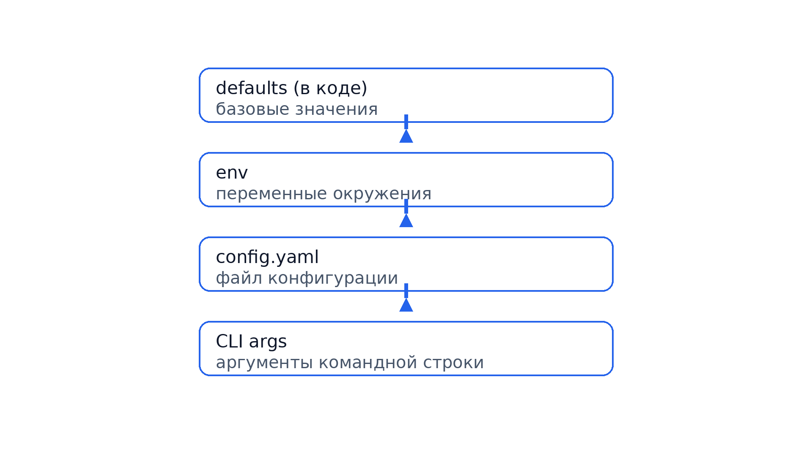
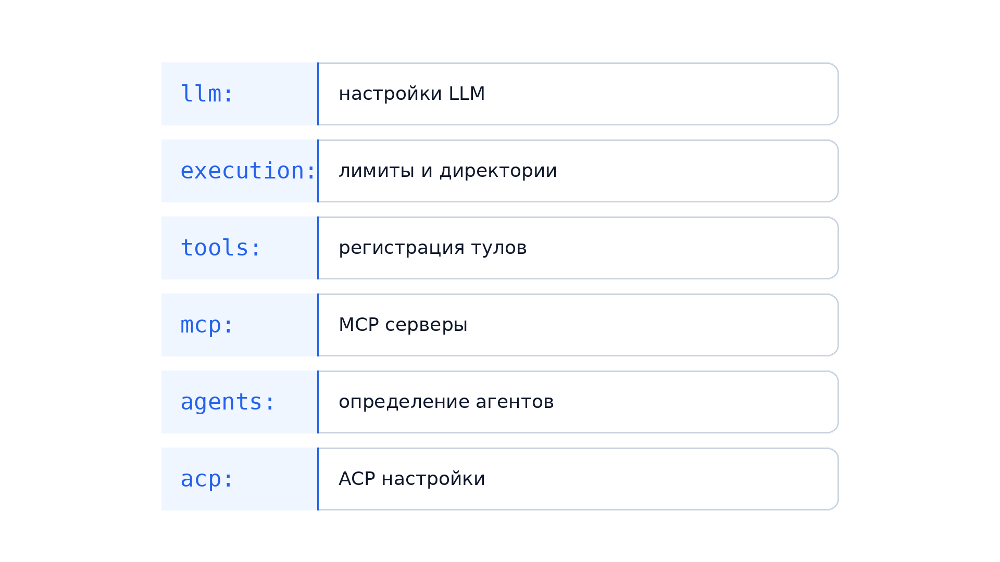
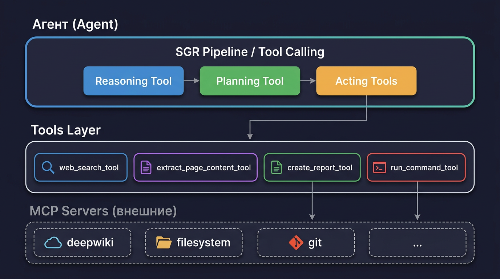
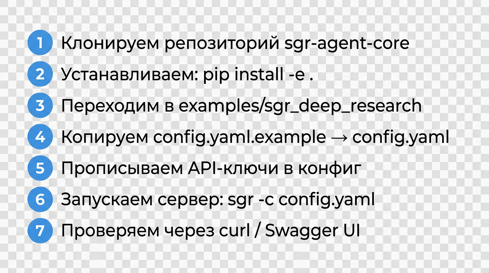
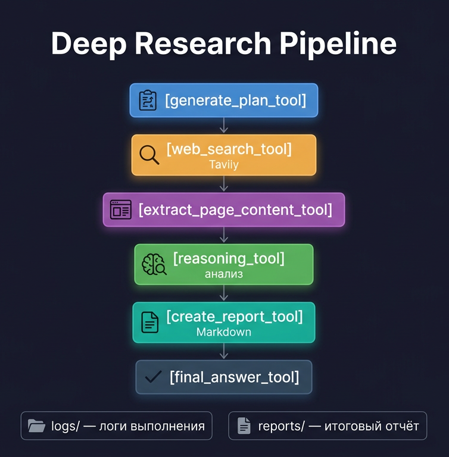
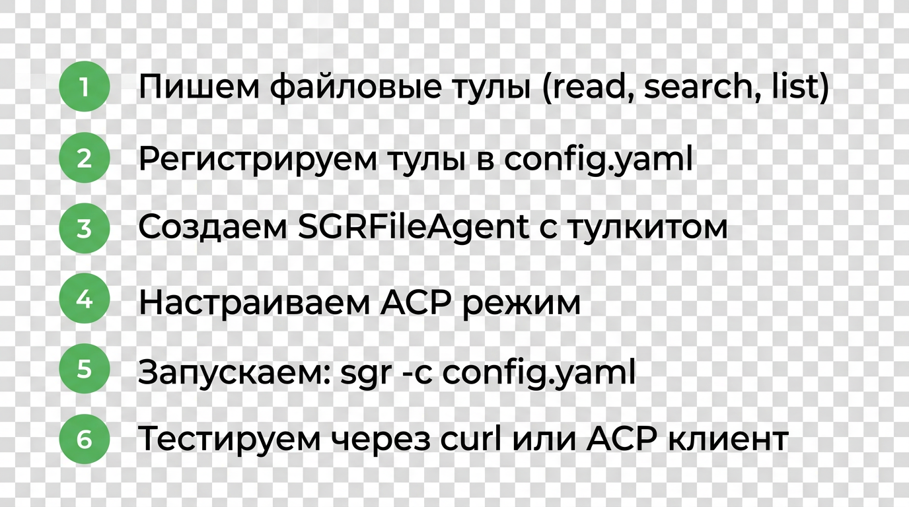
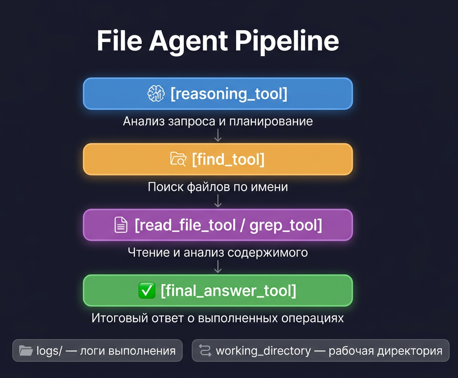

# SGR Agent Core — Мастер-класс

_Автоматическая конвертация из PPTX в Markdown._

- Исходный файл: `sgr-conference-masterclass.pptx`
- Слайдов: 14

---

## Рыков Павел — Росгосстрах

SGR Agent Core — Мастер-класс

---

## Программа мастер-класса

0. Вступление
1. Что такое SGR Agent Core
2. Архитектура
3. YAML-конфигурации
4. Что нужно для старта
5. Практика - Deep Research
6. Практика - Файловый агент
7. Домашнее задание
8. Завершение

---

## 0. Вступление

Что понадобится:
- Python 3.11+ и/или Docker
- Git
- API-ключ с моделью поддерживающей Sturctured Output
 
Материалы:
- https://github.com/vamplabai/sgr-agent-core
- https://github.com/EvilFreelancer/aiconf
 
По итогу получим:
- локальный Deep Research агент
- локальный файловый агент

---

## 1. Что такое SGR Agent Core


---

## 2. Архитектура

SGR Agent Core работает в двух режимах

**API Mode** — HTTP сервер для интеграций
- OpenAI-совместимый эндпоинт /v1/chat/completions
- Интеграции: Open WebUI, LibreChat, любой OpenAI-клиент
- Stateless (без состояния) и Stateful (с сессиями)

**ACP Mode** — Agent Client Protocol
- Stdio transport для локальных агентов
- Интеграции: Obsidian, Claude Desktop, любой ACP-хост
- Stateless-only, контекст через threads

---

## 2.1. ACP Mode — Agent Client Protocol

Что такое ACP:
- Протокол для локальных агентов (stdio transport)
- Агент запускается как подпроцесс, общается через JSON-RPC
- Поддержка tools, resources, prompts

Интеграции:
- Obsidian + Copilot plugin
- Claude Desktop
- Cursor и другие IDE

QR-код на спецификацию ACP
[QR: https://spec.modelcontextprotocol.io/]

---

## 2.2. API Mode — REST сервер

FastAPI сервер с хранилищем агентов

Жизненный цикл агента:
1. Создание — загрузка конфига, инициализация тулов
2. Выполнение — обработка запроса, SGR пайплайн
3. Очистка — освобождение ресурсов

Режимы работы:
- Stateless — каждый запрос независимый
- Stateful — сохраняется контекст диалога

Интеграции:
- Open WebUI, LibreChat, ChatGPT-Next-Web
- Любой клиент с OpenAI-compatible API

---

## 2.3. Таксономия — Тулы и Агенты

**Системные тулы:**
- `reasoning_tool` — анализ ситуации и планирование следующего шага
- `generate_plan_tool` — генерация исследовательского плана
- `adapt_plan_tool` — адаптация плана на основе новых данных
- `clarification_tool` — запрос уточнения при неоднозначности
- `final_answer_tool` — финализация задачи с ответом агента
- `answer_tool` — промежуточный ответ с продолжением диалога
- `web_search_tool` — поиск (Tavily, Brave, Perplexity)
- `extract_page_content_tool` — извлечение контента из URL
- `create_report_tool` — создание файла-отчета с цитированием
- `run_command_tool` — выполнение shell-команд (safe/unsafe режимы)

**Типы агентов:**
- `sgr_agent` - максимально строгий и управляемый SGR
- `sgr_tool_calling_agent` - SGR-логика плюс нативный tool calling с большей совместимостью и отказоустойчивостью
- `tool_calling_agent` — агент с тулколлингом, без SGR
- `dialog_agent` — диалоговый агент с промежуточными результатами
- `iron_agent` — упрощенный агент без tool calling

---

## 3. YAML-конфигурации

Наследование настроек (приоритет снизу вверх):



Структура YAML-файла:



---

## 3.1. Регистрация тулов

Схема определения тулов в конфиге:

```
tools:
  # Простая регистрация (только base_class)
  reasoning_tool: {}
  final_answer_tool: {}
  
  # С конфигурацией
  web_search_tool:
    engine: "tavily"
    api_key: "tavily_api_key"
    max_results: 10
  
  # Кастомный тул из модуля
  read_file_tool:
    base_class: "tools.ReadFileTool"
```

Тулы подключаются к агенту по имени:
```
agent:
  tools:
    - "web_search_tool"
    - "extract_page_content_tool"
    - "create_report_tool"
```

---

## 3.2. MCP интеграция

MCP (Model Context Protocol) — внешние серверы с тулами:

```
mcp:
  mcpServers:
    # Пример: DeepWiki MCP сервер
    deepwiki:
      url: "https://mcp.deepwiki.com/mcp"
    
    # Локальный stdio сервер
    filesystem:
      command: "npx"
      args: ["-y", "@modelcontextprotocol/server-filesystem"]
```

Агент автоматически получает тулы от MCP серверов.

---

## 3.3. Определение агентов

Схема определения агента:

```
agents:
  sgr_tool_calling_agent:
    base_class: "agents.ResearchSGRToolCallingAgent"
    llm:
      model: "gpt-4.1-mini"
      temperature: 0.4
    tools:
      - "web_search_tool"
      - "extract_page_content_tool"
      - "reasoning_tool"
      - "create_report_tool"
      - "final_answer_tool"
```

Выбор агента для ACP:
```
acp:
  agent: sgr_tool_calling_agent
```

---

## 3.4. Архитектура — связь компонентов

Общая схема взаимодействия:



**Агент** содержит SGR Pipeline с тремя фазами:
- Reasoning Tool — анализ и выбор стратегии
- Planning Tool — построение плана
- Acting Tools — выполнение действий через тулы

**Tools Layer** — регистрированные в конфиге тулы

**MCP Servers** — внешние серверы с дополнительными тулами

---

## 4. Что нужно для старта

**Шаг 1 — Окружение:**
- Python 3.11+ или Docker
- Git для клонирования примеров

**Шаг 2 — API-ключи:**
- OpenAI-совместимый API (обязательно)
- Tavily API key (опционально, для Deep Research)

**Шаг 3 — Конфигурация:**
- Скопировать config.yaml.example → config.yaml
- Прописать ключи в секции llm: и tools:

---

## 4.1. Установка

```bash
git clone https://github.com/vamplabai/sgr-agent-core.git
cd sgr-agent-core
pip install -e .
```

---

## 4.2. Токены и где их взять

**OpenAI-совместимый API:**
- OpenAI: https://platform.openai.com/api-keys
- Другие провайдеры с OpenAI-compatible API

**Tavily (для поиска):**
- https://tavily.com — 1000 запросов/месяц бесплатно

**Альтернативный вариант для мастер-класса:**
- API: https://api.rpa.icu
- Ключ: https://t.me/evilfreelancer
- Модель: gpt-oss:120b

---

## 4.3. Пример настройки LLM для api.rpa.icu

```yaml
llm:
  base_url: "https://api.rpa.icu/v1"
  api_key: "https://t.me/evilfreelancer"
  model: "gpt-oss:120b"
```

---

## 5. Практика: Deep Research

**СЛЕВА — Что делаем (пошагово):**



**СПРАВА — Что получим в итоге:**



Цель практики — запустить рабочий Deep Research агент из пакета sgr-agent-core

---

## 5.1. Команды и Jupyter notebook

Команды для практики:

```bash
git clone https://github.com/vamplabai/sgr-agent-core.git
cd sgr-agent-core
pip install -e .
cd examples/sgr_deep_research
cp config.yaml.example config.yaml
sgr -c config.yaml
```

Jupyter notebook с теми же шагами:

https://github.com/EvilFreelancer/aiconf/blob/main/practice-01-deep-research.ipynb

---

## SGR Agent Core — Мастер-класс

Перерыв 10-15 минут

---


##  6. Практика: Файловый агент

**СЛЕВА — Пошаговый план:**



**СПРАВА — Что получим:**



Цель практики — создать рабочий файловый агент на базе пакета sgr-agent-core

---

##  6.1. Практика: Файловый агент — Тулы

**Базовые тулы для работы с файлами:**

| Тул | Назначение | Параметры |
|-----|-----------|-----------|
| `read_file_tool` | Чтение содержимого файла | `file_path`, `offset`, `limit` |
| `write_file_tool` | Запись/дозапись в файл | `file_path`, `content` |
| `list_dir_tool` | Список файлов в директории | `dir_path`, `recursive` |
| `grep_tool` | Поиск по содержимому файла | `pattern`, `file_path` |
| `find_tool` | Быстрый поиск файлов по имени | `pattern`, `dir_path` |

---

##  6.2. Практика: Файловый агент — Конфиг тулов

```yaml
tools:
  # Системные тулы
  clarification_tool: {}
  final_answer_tool: {}
  
  # Файловые тулы (кастомные)
  read_file_tool:
    base_class: "tools.ReadFileTool"
  write_file_tool:
    base_class: "tools.WriteFileTool"
  list_dir_tool:
    base_class: "tools.ListDirTool"
  grep_tool:
    base_class: "tools.GrepTool"
  find_tool:
    base_class: "tools.FindTool"
```

Каждый тул наследуется от `BaseTool` и определяет:
- Pydantic-модель входных параметров
- Метод `__call__` с логикой выполнения

---

## 6.3. Практика: Файловый агент — Код агента

**Структура SGRFileAgent:**

```python
class SGRFileAgent(SGRToolCallingAgent):
    """Агент для работы с файловой системой."""
    
    def __init__(
        self,
        config: AgentConfig,
        working_directory: str = ".",
        **kwargs
    ):
        super().__init__(config, **kwargs)
        self.working_directory = Path(working_directory).resolve()
        
        # Проверяем и создаем рабочую директорию
        if not self.working_directory.exists():
            raise ValueError(
                f"Working directory does not exist: {self.working_directory}"
            )
    
    async def execute(self, context: AgentContext) -> str:
        """Выполнение с проверкой безопасности путей."""
        # Все операции ограничены working_directory
        # Предотвращаем выход за пределы рабочей директории
        return await super().execute(context)
```

**Ключевые особенности:**
- `working_directory` — рабочая директория агента (ограничение песочницы)
- Проверка путей — все операции внутри working_directory
- Наследование от `SGRToolCallingAgent` — SGR пайплайн + тулколлинг

---

## 6.4. Практика: Файловый агент — Конфиг агента

```yaml
agents:
  sgr_file_agent:
    base_class: "sgr_file_agent.SGRFileAgent"
    working_directory: "."
    execution:
      max_iterations: 3
      max_clarifications: 1
      logs_dir: "logs/file_agent"
    tools:
      - "clarification_tool"
      - "final_answer_tool"
      - "get_system_paths_tool"
      - "list_dir_tool"
      - "read_file_tool"
      - "grep_tool"
      - "find_tool"
```

---

## 6.5. Практика: Файловый агент — Промпт и workflow

**Пример выполнения запроса "Найди все TODO в проекте":**

1. **reasoning_tool** — анализирует задачу и планирует шаги
2. **find_tool** — находит файлы проекта
3. **grep_tool** — ищет TODO-комменты в найденных файлах  
4. **final_answer_tool** — формирует отчет с результатами

---

## 7. Домашнее задание

**СЛЕВА — Задание 1: Настройка Langfuse**

Цель: настроить трассировку выполнения агентов

Что сделать:
1. Зарегистрироваться на https://langfuse.com
2. Получить API-ключи (publicKey, secretKey)
3. Добавить в config.yaml секцию observability:
```yaml
observability:
  langfuse:
    enabled: true
    public_key: "${LANGFUSE_PUBLIC_KEY}"
    secret_key: "${LANGFUSE_SECRET_KEY}"
    host: "https://cloud.langfuse.com"
```
4. Запустить агента и проверить трейсы в UI

Что проверить: каждый шаг агента виден в трейсах

---

**СПРАВА — Задание 2: ACP интеграция с VS Code**

Цель: подключить файловый агент к VS Code через ACP

Что сделать:
1. Запустить SGR Agent Core в ACP режиме:
```bash
sgracp -c sgr-file-agent/config.yaml
```
2. Настроить подключение в VS Code (через расширение с поддержкой ACP)
3. Проверить команды:
   - "Найди все TODO в проекте"
   - "Покажи структуру папки src"
   - "Прочитай файл README.md"

Что проверить: агент отвечает на запросы из редактора

---

## 8. Завершение

Секция Q&A:
- Вопросы по материалам мастер-класса
- Сложности при настройке окружения
- Идеи для собственных агентов

Ресурсы:
- Блокноты: https://github.com/EvilFreelancer/aiconf
- Репозиторий: https://github.com/vamplabai/sgr-agent-core
- Документация: https://vamplabai.github.io/sgr-agent-core/
- Мой телеграм: https://t.me/evilfreelancer

---

## SGR Agent Core — Мастер-класс

Спасибо за внимание!

---
