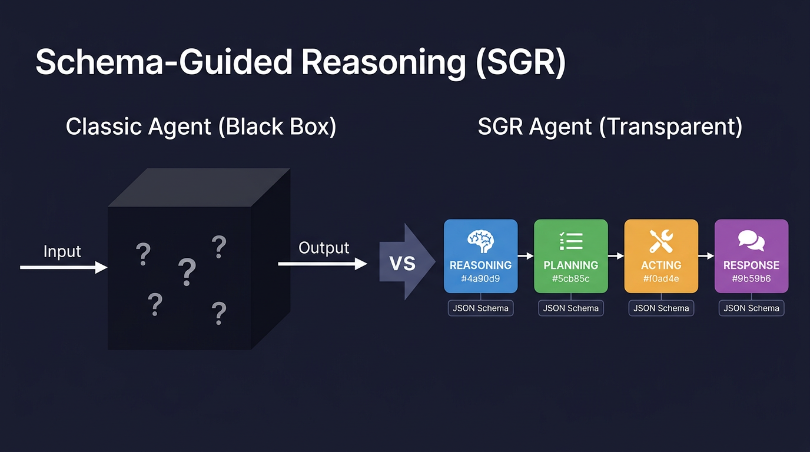
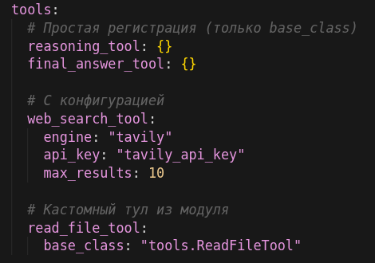
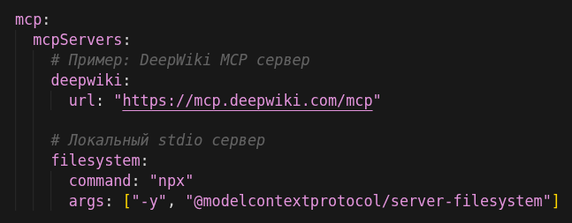
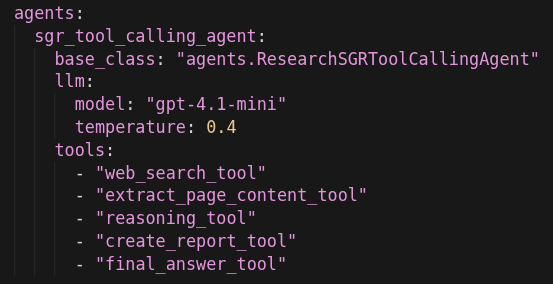
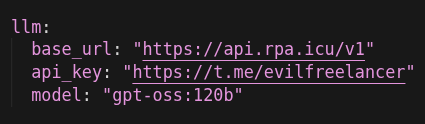
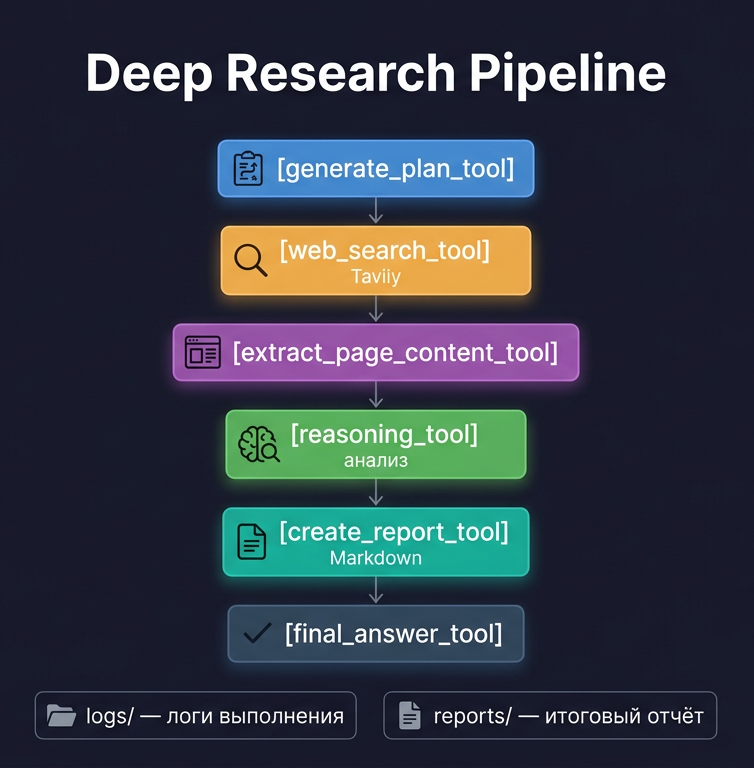
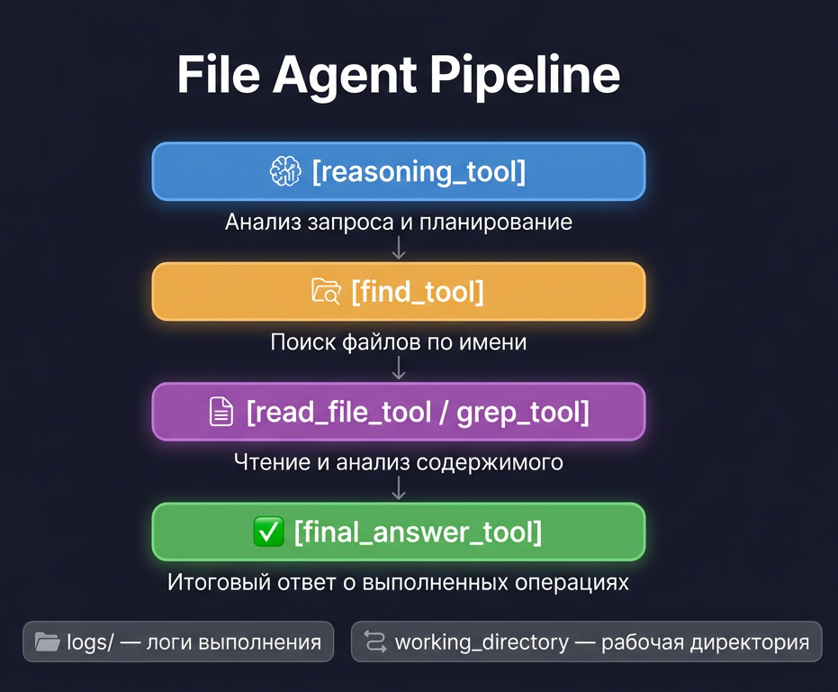

# SGR Agent Core — Мастер-класс

_Автоматическая конвертация из PPTX в Markdown._

- Исходный файл: `masterclass.pptx`
- Слайдов: 27

---

## Слайд 1

Рыков Павел Росгосстрах

SGR Agent Core Мастер-класс

---

## Слайд 2

Программа мастер-класса

0. Вступление

1. Что такое SGR Agent Core

2. Архитектура

3. YAML-конфигурации

4. Что нужно для старта

5. Практика - Deep Research

6. Практика - Файловый агент

7. Домашнее задание

8. Завершение

---

## Слайд 3

0. Вступление

Что понадобится:

- Python 3.11+ и/или Docker

- Git

- API-ключ с моделью поддерживающей Structured Output или Tool Calling

Ресурсы:

- Блокноты: https://github.com/vamplabai/sgr-agent-core

- Репозиторий: https://github.com/EvilFreelancer/aiconf

- Документация: https://vamplabai.github.io/sgr-agent-core/

По итогу получим:

- локальный Deep Research агент

- локальный файловый агент

---

## Слайд 4

1. Что такое SGR Agent Core

---

## Слайд 5

2. Архитектура

SGR Agent Core работает в двух режимах

API Mode — HTTP сервер для интеграций

- OpenAI-совместимый эндпоинт /v1/chat/completions

- Интеграции: Open WebUI, LibreChat, любой OpenAI-клиент

- Stateless (без состояния) и Stateful (с сессиями)

ACP Mode — Agent Client Protocol

- Stdio transport для локальных агентов

- Интеграции: Obsidian, Claude Desktop, любой ACP-хост

- Stateless-only, контекст через threads

---

## Слайд 6

2.1. Agent Client Protocol (ACP)

Что такое ACP:

- Протокол для локальных агентов (stdio transport)

- Агент запускается как подпроцесс, общается через JSON-RPC

- Поддержка tools, resources, prompts

Интеграции:

- Obsidian + Copilot plugin

- Claude Desktop

- Cursor и другие IDE

https://github.com/agentclientprotocol/agent-client-protocol

---

## Слайд 7

2.2. API Mode — REST сервер

FastAPI сервер с хранилищем агентов

Жизненный цикл агента:

1. Создание — загрузка конфига, инициализация тулов

2. Выполнение — обработка запроса, SGR пайплайн

3. Очистка — освобождение ресурсов

Режимы работы:

- Stateless — каждый запрос независимый

- Stateful — сохраняется контекст диалога

Интеграции:

- Open WebUI, LibreChat, ChatGPT-Next-Web

- Любой клиент с OpenAI-compatible API

---

## Слайд 8

2.3. Системные тулы

- `reasoning_tool` — анализ ситуации и планирование следующего шага

- `generate_plan_tool` — генерация исследовательского плана

- `adapt_plan_tool` — адаптация плана на основе новых данных

- `clarification_tool` — запрос уточнения при неоднозначности

- `final_answer_tool` — финализация задачи с ответом агента

- `answer_tool` — промежуточный ответ с продолжением диалога

- `web_search_tool` — поиск (Tavily, Brave, Perplexity)

- `extract_page_content_tool` — извлечение контента из URL

- `create_report_tool` — создание файла-отчета с цитированием

- `run_command_tool` — выполнение shell-команд (safe/unsafe режимы)

---

## Слайд 9

2.4. Встроенные агенты

- `sgr_agent` - максимально строгий и управляемый SGR

- `sgr_tool_calling_agent` - SGR-логика плюс нативный tool calling с большей совместимостью и отказоустойчивостью

- `tool_calling_agent` — агент с тулколлингом, без SGR

- `dialog_agent` — диалоговый агент с промежуточными результатами

- `iron_agent` — упрощенный агент без tool calling

---

## Слайд 10

3. YAML-конфигурация

Приоритет

4. Дефолты фреймворка

3. Переменные окружения

2. Конфигурация

1. Параметры CLI

---

## Слайд 11

3.1. Реестр тулов

---

## Слайд 12

3.2. Реестр MCP-серверов

---

## Слайд 13

3.3. Реестр агентов

---

## Слайд 14

3.4. Cвязь компонентов

Агент содержит SGR Pipeline с тремя фазами:

- Reasoning Tool — анализ и выбор стратегии

- Planning Tool — построение плана

- Acting Tools — выполнение действий через тулы

Tools Layer — зарегистрированные в конфиге тулы

MCP Servers — внешние серверы с дополнительными тулами

---

## Слайд 15

4. Что нужно для старта

Шаг 1 — Окружение:

- Python 3.11+

- Git для клонирования примеров

Шаг 2 — API-ключи:

- OpenAI-совместимый API (обязательно)

- Tavily API key (для Deep Research)

Шаг 3 — Конфигурация:

- Скопировать config.yaml.example → config.yaml

- Прописать ключи в секции llm: и tools:

---

## Слайд 16

4.1. Установка

git clone https://github.com/vamplabai/sgr-agent-core.git

cd sgr-agent-core

python3 -m venv .venv

. .venv/bin/activate

pip install -e .

---

## Слайд 17

4.2. Токены и где их взять

OpenAI-совместимый API:

- OpenAI: https://platform.openai.com/api-keys

- Другие провайдеры с OpenAI-compatible API

Tavily (для поиска):

- https://tavily.com — 1000 запросов/месяц бесплатно

Альтернативный вариант для мастер-класса:

- API: https://api.rpa.icu

- Ключ: https://t.me/evilfreelancer

- Модель: gpt-oss:120b (ограничение, не более 20 человек)

---

## Слайд 18

4.3. Пример через api.rpa.icu

---

## Слайд 19

5. Практика: Deep Research

Что делаем:

1. Клонируем репозиторий sgr-agent-core

2. Устанавливаем pip install -e .

3. Переходим в examples/sgr_deep_research

4. Копируем config.yaml.example -> config.yaml

5. Прописываем API-ключи в конфиг

6. Запускаем сервер sgr -c config.yaml

7. Проверяем через curl или Swagger UI

Что получим в итоге:

---

## Слайд 20

5.1. Команды и Jupyter notebook

Команды для практики:

git clone https://github.com/vamplabai/sgr-agent-core.git

cd sgr-agent-core

pip install -e .

cd examples/sgr_deep_research

cp config.yaml.example config.yaml

sgr -c config.yaml

Jupyter notebook с шагами:

https://github.com/EvilFreelancer/aiconf/blob/main/practice-01-deep-research.ipynb

---

## Слайд 21

SGR Agent Core Мастер-класс

Перерыв 10-15 минут

А дальше…. Делаем файловый агент своми руками

---

## Слайд 22

6. Практика: Файловый агент

Что делаем:

1. Пишем файловые тулы `read, search, list`

3. Создаем `SGRFileAgent` с тулкитом

2. Регистрируем тулы в `config.yaml`

4. Запускаем `sgr -c config.yaml`

5. Тестируем через curl

Что получим в итоге:

---

## Слайд 23

6.1. Команды и Jupyter notebook

Команды для практики:

pip install sgr-agent-core openai pydantic

mkdir -pv sgr-file-agent/{tools,logs}

cd sgr-file-agent

# создадим код тулов и агента, а так же конфигурацию

sgr -c config.yaml

Jupyter notebook с шагами:

https://github.com/EvilFreelancer/aiconf/blob/main/practice-02-file-agent.ipynb

---

## Слайд 24

6.2. Варианты использования

**Примеры UI и чат-клиентов под OpenAI-compatible API**

- [Open WebUI](https://github.com/open-webui/open-webui) - локальный веб-интерфейс, гибкая настройка провайдеров
- [LibreChat](https://github.com/danny-avila/LibreChat) - мульти-модельный чат с плагинами и агентами
- [Continue](https://github.com/continuedev/continue) - ассистент в IDE с поддержкой нескольких провайдеров
- Любые обёртки и SDK, которые умеют `OPENAI_BASE_URL` (скрипты, мобильные клиенты, собственные бэкенды)

**Примеры cвязка с UI через ACP**

- [Zed](https://zed.dev/acp) - нативная панель агента, документация по `agent_servers`
- [JetBrains IDE](https://zed.dev/acp) - в экосистеме ACP (совместная работа JetBrains и Zed над протоколом)
- [VS Code](https://github.com/formulahendry/vscode-acp) - расширение ACP Client (Marketplace - `formulahendry.acp-client`), пресеты для Codex CLI, Claude Code, Gemini CLI и др.
- [Obsidian](https://zed.dev/acp/editor/obsidian) - плагин Agent Client, работа с заметками и терминалом из хранилища

---

## Слайд 25

7. Домашнее задание

Цель: настроить трассировку выполнения агентов

Что сделать:1. Зарегистрироваться на https://langfuse.com

2. Получить API-ключи (publicKey, secretKey)

3. Добавить в config.yaml секцию observability:

observability:

langfuse:

enabled: true

public_key: "${LANGFUSE_PUBLIC_KEY}"

secret_key: "${LANGFUSE_SECRET_KEY}"

host: "https://cloud.langfuse.com"

4. Запустить агента и проверить трейсы в UI

Что проверить: каждый шаг агента виден в трейсах

Цель: подключить файловый агент к VS Code через ACP

Что сделать:

1. Запустить SGR Agent Core в ACP режиме:

sgracp -c sgr-file-agent/config.yaml

2. Настроить подключение в VS Code (через расширение с поддержкой ACP)

3. Проверить команды:

- "Найди все TODO в проекте"

- "Покажи структуру папки src"

- "Прочитай файл README.md"

Что проверить: агент отвечает на запросы из редактора

---

## Слайд 26

8. Завершение

Секция Q&A:

- Вопросы по материалам мастер-класса

- Сложности при настройке окружения

- Идеи для собственных агентов

Ресурсы:

- Блокноты: https://github.com/EvilFreelancer/aiconf

- Репозиторий: https://github.com/vamplabai/sgr-agent-core

- Документация: https://vamplabai.github.io/sgr-agent-core/

- Мой телеграм: https://t.me/evilfreelancer

---

## Слайд 27

SGR Agent Core Мастер-класс

Спасибо за внимание!

---
